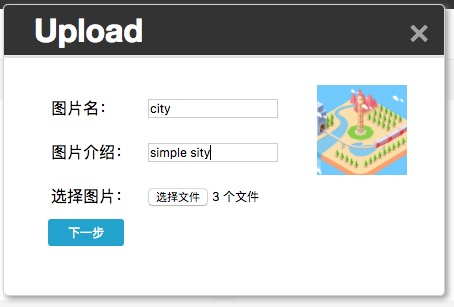

# 第二周总结

## 项目任务

+ 整理代码，解除耦合，优化服务器逻辑
+ 重做前端，换成更有设计感的页面
+ 前端增加图片阅读次数实时显示
+ 增加多文件上传功能，并修改服务器代码兼容多文件上传
+ 增加文件上传进度条功能，显示上传文件进度
+ 增加图片上传时预览功能
+ 增加等待时的loading界面

## 内容报告

### 1、 优化服务器端代码

上次服务器端代码编写时，对逻辑未能理顺。使用了一个函数兼顾了post的文件上传和get的阅读次数增一。因此需要先使用find查询，再根据回调中数据库返回的数据，判断该操作是要自增一还是新增数据库文档。

因使用了大量回调函数，和对response的处理不同，导致代码很混乱并且难以调试、判断处理问题。陈泽也指出，在前端图片全部是数据库中返回之下，自增一操作根本不需要再次查询数据库进行重复判断。

因此此次优化对该大函数进行了细化切分。对数据库的find和insert操作独立出来，给post调用，而get自增一操作只负责update。

```javascript
// 老代码逻辑
// 主要判断 自增 或 新增数据 的函数
function dbAddReadTimes(obj, isPost, isReqResult, res) {
// 略大量代码，只显示逻辑
   // 连接数据库
   MongoClient.connect('mongodb://192.168.0.118:27017/express', function(err, db) {
        if (err) {
            throw err;
        }
        var collection = db.collection('imgshowTimes');
        // 查数据库中 图片显示次数的集合 的所有文档
        collection.find().toArray(function(err, result) {
            
            console.log('1');
            // 遍历结果，查找是否有 该文件名的数据
            for (let i = 0; i < result.length; i++) {
                if (result[i]['filename'] === obj.filename) {
                    isHaveFileName = true;
                    // 找到的话 放到自增数组中准备自增操作
                    plusFileName.push(obj.filename);
                } else {
                    //没找到的话说明 没有该文件名的数据
                    isHaveFileName == false;
                }
            }
            // 没有该文件名 则准备在数据库中增加该文件的数据
            if (isHaveFileName == false) {
                addFileName.push(obj);
            }
          	// 新建列表中有数据则insert操作
            if (addFileName !== []) {
                addFileToDb(addFileName, db, res);
            }
          	// 自增列表中有数据则update操作
            if (plusFileName !== [] && isPost === false) {
                plusReadTimes(plusFileName, db, res);
            }
          	// 是post还要返回再查询数据库
            if (isPost === true) {
                dbShowAllFiles(res);
            }
        });
    });
}
```

优化后：

```javascript
//--------Post专用，往数据库中插入新值，有查询和插入操作--------
function addDataToDb(data, res) {
    var addFileName = [];
    // 连接数据库
    MongoClient.connect('mongodb://192.168.0.118:27017/express', function(err, db) {
        if (err) {
            throw err;
        }
        var collection = db.collection('imgshowTimes');
        // 查数据库中 图片显示次数的集合 的所有文档
        collection.find().toArray(function(err, result) {
            if (err) {
                console.error(err);
            }
            //得到查询数据
            console.log('查找数据库成功，接下来开始判断要增加数据的条目');
            // 遍历结果，查找是否有 该文件名的数据
            if (data instanceof Array) {
              	// !!!!此处兼容了后面增加的多文件上传功能
                //上传列表是多个的话
                data.forEach(function(val, index) {
                    let isHaveFileName = false;
                    for (let i = 0; i < result.length; i++) {
                        if (result[i]['filename'] === val.filename) {
                            isHaveFileName = true;
                            // 找到的话 说明该文件存在，无操作
                        }
                    }
                    isHaveFileName ? null : addFileName.push(val);
                });

            } else {
                //上传文件数只有一个的话
                let isHaveFileName = false;
                for (let i = 0; i < result.length; i++) {
                    if (result[i]['filename'] === data.filename) {
                        isHaveFileName = true;
                        // 找到的话 说明该文件存在，无操作
                    }
                }
                isHaveFileName ? null : addFileName.push(data);
            }
            console.log('新增条目判明成功，以下是要新增的条目：');
            console.log(addFileName);
            // 没有该文件名 则准备在数据库中增加该文件的数据
            if (addFileName !== []) {
                addFileToDb(addFileName, db, res);
            }
          	// 数据库中有短暂的插入事件，设置个延迟之后返回数据
            setTimeout(() => dbShowAllFiles(res), 100);
            db.close();
        });
    });
}
//-----向数据库中增加数据-----------
function addFileToDb(arr, db, res) {
    for (let i = 0; i < arr.length; i++) {
        console.log('执行数据插入操作');
        console.log(arr[i]);
      	// 插入的全部项，比之前新增了很多，用于实现更复杂的功能
        db.collection('imgshowTimes').insert({
            'filename': arr[i].filename,
            'imgTitle': arr[i].imgTitle,
            'imgURL': arr[i].imgURL,
            'intro': arr[i].intro,
            'uploader': arr[i].uploader,
            'uploaderHeadshot': arr[i].uploaderHeadshot,
            'uploadTime': arr[i].uploadTime,
            'likes': 0,
            'cmnt': 0,
            'showTimes': 0,
        });
    }
}
```

```javascript
// --------阅读次数自增1----------
function dbAddReadTimes(filename) {
    // 连接数据库
    MongoClient.connect('mongodb://192.168.0.118:27017/express', function(err, db) {
        if (err) {
            throw err;
        }
        var collection = db.collection('imgshowTimes');
        //-----使存在的文件阅读次数加1------------
        console.log('执行自增一');
        db.collection('imgshowTimes').update({ 'filename': filename }, { $inc: { 'showTimes': 1 } }, 0, 1);
        db.close();
    });
}
```

分家之后，post就算增加了数组上传之后也逻辑简明了许多。


### 2、 重做前端页面、前端增加图片阅读次数展示

之前前端页面更类似于一个随便搭建的框子，用来跑项目

这次换成了比较美观的页面，灵感来源于 [dribbble](https://dribbble.com/shots) 。

旧页面大致布局（旧项目没有截图，右边是各种图片）：


新页面：


局部内容：


如上面主页图所示，每个图片框下有一个小眼睛，右边就是图片被阅读次数

功能实现很简单，后端发送给前端的数据库列表数据中就有阅读次数，然后前端渲染图片列表时，vue组件直接通过数据绑定span就可以了

```html
<!--三个数据分别是展示次数、评论数、喜欢人数。后两个功能暂未实现-->
<ul class="extra">
  <li><span class="views">{{imgData.showTimes}}</span></li>
  <li><span class="cmnt">{{imgData.cmnt}}</span></li>
  <li><span class="fav" @click.stop="liked">{{imgData.likes}}</span></li>
</ul>
```


### 3、 前端代码解耦

之前父组件和子组件通信时，父组件数据通往子组件时通过props：

```javascript
Vue.component('photos', {
    template: '略',
    props: ['data'],
});
```

而子组件往父组件通信时，选择了直接操作父组件实例内容：

```javascript
var app = new Vue({
	data: {
      	times: 1
	}
});
Vue.component('photos', {
    template: '略',
    props: ['data'],
  	methods: {
      	sendData: function(data) {
          	// 不科学
          	app.times = data;
      	}
  	}
});
```

操作实例改变父data内容，使组件中代码复用性极差，换个环境，父元素不叫app了就得重新改一遍。

经过更深入学习Vue，发现Vue提供了一个很好的（子=>父）通信方式：自定义事件

```html
<photo @send-data="receiveData"></photo>
```

```javascript
var app = new Vue({
	data: {
      	times: 1
	},
  	methods: {
      	receiveData: function(value){
          	this.times = value;
      	}
  	}
});
Vue.component('photo', {
    template: '略',
    props: ['data'],
  	data: function(){
      	return {
          	// 子元素数据
        	selfTime: 9,
      	}
  	},
  	methods: {
      	sendData: function(val) {
          	// 用emit方法触发事件，然后被HTML中父元素监听接收，最后执行父元素方法操作，改变父元素值
          	this.$emit('sendData', val)
      	},
      	other: function(){
          	// 调用sendData给父元素发送数据
          	this.sendData(this.selfTime);
      	}
  	}
});
```


### 4、 文件上传 与 多文件上传

上次实习报告忘了说文件上传这一块，这次和多文件上传一块说了

并且因为兼容多文件上传，前端用户页面也做了微调，旧form方式就不合适了，因此这里也做了较大改动

#### 前端

文件上传框我使用了一个vue的component。HTML元素使用了form、input[type=file]、两个input[type=text]和input[type=submit]。

文本输入框负责一个接收“图片标题”，一个负责“图片简介”。js整合之后用ajax发送到后端。

```javascript
// 简单模型
// 新建formdata
let data = new formData();
// 往formdata中添加文件,另一种formdata方式：
// let formData = new FormData($('form')[0]);
data.append('upload',$('input[type=file]')[0].files[0]);
// 添加其他信息
data.append('imgTitle',$('input[name=imgTitle]').val());
// 如果想添加多个该信息，不能直接跟数组，而是多次为该键append数据
// data.append('imgTitle', 'data2';
// data.append('imgTitle', 'data3');
formdata数据上传：
$.post('/urlhere',data,function(){});
```

对于多文件上传，formdata中upload属性必然是多个，可以多次给upload属性添加input[type=file]的files[0]，也可以直接使用构造函数模式，参数放入整个form元素，formdata会自动提取文件。

因为我项目中是选择单个input[type=file]多选文件模式，因此使用了构造函数创建formdata方式。然后根据选择文件个数，改变前端界面，手动挨个输入图片相关信息。

```javascript
// 添加信息
this.formData.append('imgTitle', this.uploadNames || 'No name');
this.formData.append('intro', this.uploadIntros || 'nothing');
// 剩余图片数减一
this.leftPictureNum--;
// 清空输入框
this.uploadNames = null;
this.uploadIntros = null;
// 马上再次自动聚焦到input上输入下个元素的信息
$('input[name=imgTitle]').focus();
```

#### 后端

对于formdata上传的文件，存在于request.files.files中。若上传的多文件，它是一个数组。

formdata上传的其他信息如图片标题，图片介绍等，存在于request.body中。若多文件信息，request.body不是一个数组，但子属性如request.body.imgTitle会是一个数组。根据这种数组判断，可以写出兼顾obj和array的代码

```javascript
// 使用了connect-multiparty插件整合文件，需要先npm install connect-multiparty --save-dev
var multipart = require('connect-multiparty');
// post路由中
router.post('/images', multipart(), function(req, res) {
  var filename,
      targetPath,
      // 定义根目录
      _dirname = path.resolve(path.dirname(''));
  //判断多文件上传情况
  if (req.files.files instanceof Array) {
    filename = [];
    req.files.files.forEach(function(val, index) {
      // 分别获得文件名
      filename.push(val.originalFilename);
      // 定义放置图片的目录
      targetPath = _dirname + '/public/images/' + val.originalFilename;
      // ！！！！管道流写出文件到服务器，文件上传的重要步骤
      fs.createReadStream(val.path).pipe(fs.createWriteStream(targetPath));
    });
  } else {
    // 单文件上传情况，区别是不用foreach遍历了
    filename = req.files.files.originalFilename;
    targetPath = _dirname + '/public/images/' + filename;
    fs.createReadStream(req.files.files.path).pipe(fs.createWriteStream(targetPath));
  }

  //打包数据
  function sendToDbData(filename, req) {
    // 判断数组操作
    if (filename instanceof Array) {
      let objs = [];
      filename.forEach(function(filename, index) {
        // 挨个打包并初始化
        let obj = {
          filename: filename,
          imgTitle: (() => req.body.imgTitle ? req.body.imgTitle[index] : 'No name')(),
          imgURL: './images/' + filename,
          intro: (() => req.body.intro ? req.body.intro[index] : '')(),
          uploader: (() => req.body.uploader ? req.body.uploader[index] : randomName().name)(),
          uploaderHeadshot: (() => req.body.uploaderHeadshot ? req.body.uploaderHeadshot[index] : randomName().headshot)(),
          uploadTime: createtimer(),
        }
        objs.push(obj);
      });
      return objs;
    } else {
      return {
        filename: filename,
        imgTitle: req.body.imgTitle || 'No name',
        imgURL: './images/' + filename,
        intro: req.body.intro,
        uploader: req.body.uploader || randomName().name,
        uploaderHeadshot: req.body.uploaderHeadshot || randomName().headshot,
        uploadTime: createtimer(),
      }
    }
  }
  // 获得打包后的obj，可能是一个object，也可能是object的array
  let obj = sendToDbData(filename, req);
  // 调用数据库写入函数
  addDataToDb(obj, res);
)};
```


### 5、 上传进度条

HTML中提供了一个进度条组件：

```html
<progress id="uploadprogress" min="0" max="100" :value="progressValue"></progress>
<!--操作value会改变进度条进度-->
```

在XMLHttpRequest实例中的属性upload有一个事件onprogress可以监听ajax的上传进度：

```javascript
var xhr = new XMLHttpRequest();
xhr.upload.onprogress = function (event) {
  if (event.lengthComputable) {
    // event.loaded是目前装载数，event.total是总数
    // 相除得到百分比
    var complete = (event.loaded / event.total * 100 | 0);
    var progress = document.getElementById('uploadprogress');
    progress.value = progress.innerHTML = complete;
  }
};
```

但是我的项目中使用的是jquery的$.ajax，它自己封装的对象，我并不能接触到。因此搜了一个另外的jquery封装的方法，需要引入一个 [插件](https://github.com/englercj/jquery-ajax-progress/blob/master/js/jquery.ajax-progress.js) ：

```javascript
// jquery.ajax-progress.js
(function($, window, undefined) {
    //is onprogress supported by browser?
    var hasOnProgress = ("onprogress" in $.ajaxSettings.xhr());
    //If not supported, do nothing
    if (!hasOnProgress) {
        return;
    }
    //patch ajax settings to call a progress callback
    var oldXHR = $.ajaxSettings.xhr;
    $.ajaxSettings.xhr = function() {
        var xhr = oldXHR();
        if (xhr instanceof window.XMLHttpRequest) {
            xhr.addEventListener('progress', this.progress, false);
        }
        if (xhr.upload) {
            xhr.upload.addEventListener('progress', this.progress, false);
        }
        return xhr;
    };
})(jQuery, window);
```

将此代码保存进文件，并在HTML中引入该文件，然后就可以在$.ajax中使用progress事件了：

```javascript
$.ajax({
  //其他略
  progress: function(e) {
    if (e.lengthComputable) {
      // 将数据输入自己的进度条组件
      This.progressValue = (e.loaded / e.total) * 100;
    }
    else {
      console.warn('进度条长度出错!');
    }
  }
});
```

效果(藏在标题下面一半的蓝条，现在是已经装载完毕的效果)：


### 6、 图片上传预览

因为此项目是先点击图片上传，选择图片，然后输入图片信息。

只上传单文件还好，若是上传多文件，很难记起来自己现在输入信息对应的是哪张图片。因此输入信息时，把对应的图片展示在输入框旁边就很有必要了。这里使用FileReader对象：

```javascript
// 创建FileReader对象
var reader = new FileReader();
// 装载后出发的回调，创建图片元素
reader.onload = function(event) {
  var image = new Image();
  // 图片URL设置为event.target.result
  image.src = event.target.result;
  $('.picturePre').append(image);
};
// reader得到input[type=file]中的文件信息
reader.readAsDataURL($('input[type=file]')[0].files[0]);
```

项目中使用：

```javascript
// 预览图片，用到FileReader
// i是input[type=file]中的第几个文件
picturePre: function(i) {
  $('.picturePre').empty();
  // 检查是否支持FileReader对象，不支持什么都不操作
  if (typeof FileReader != 'undefined') {
    // 定义可接受的图片类型
    var acceptedTypes = {
      'image/png': true,
      'image/jpeg': true,
      'image/gif': true,
    };
    // 图片符合可接受的类型才进行展示
    if (acceptedTypes[$('input[type=file]')[0].files[i].type] === true) {
      var reader = new FileReader();
      reader.onload = function(event) {
        var image = new Image();
        image.src = event.target.result;
        $('.picturePre').append(image);
      };
      reader.readAsDataURL($('input[type=file]')[0].files[i]);
    }
  }
}
```

效果图：




### 7、 添加Loading的界面

由于打开页面——发送ajax请求数据——服务器回应——前端收到数据并渲染——图片列表显示这个过程需要很长时间，而此时页面上会出现没有“正文”的时期。页面只有header和footer，显得很丑陋。因此需要在此时期出现一个loading界面来缓解尴尬。

思路很简单，用Vue提供的生命周期钩子来操作loading界面的显示与隐藏。

我们期待的是页面渲染出现时loading界面跟着显示，photos渲染完毕loading就功成身退。

vue提供的生命周期：

+ beforeCreate     实例创建前
+ created               实例创建时
+ beforeMount     被渲染到dom前
+ mounted            被渲染到dom时
+ beforeUpdate    dom中重新渲染前
+ updated              dom中重新渲染后
+ beforeDestroy    摧毁命令发出，但还没被摧毁（vm.$destroy()）
+ destroyed            被摧毁，所有后代和事件监听全部解除

因此用到的生命周期钩子是主元素的created和子元素的mounted。并通过主元素控制loading的v-show。

loading界面暂时选择使用gif动画。给一个div设置background达成。

```javascript
// Vue实例中
created: function() {
  let url = '/photos/images/getImgData?',
      This = this;
  console.log('ready!');
  // 显示loading界面
  this.showLoading();
  $.get(url, function(data, status) {
    console.log('success');
    // 随机做一个延迟，减缓后端数据传回时间，给loading屏幕显示时间（测试用）
    let ranDelay = Math.floor(500 + 1000 * Math.random());
    setTimeout(() => This.ajaxData = data, ranDelay);
  });
}
```

```javascript
// 子元素中
mounted: function() {
  console.log('图片已经准备好了');
  this.hideloading();
  // 通过hideloading方法传给父元素信号，从而隐藏loading界面
}
```


## 总结

由于上一周囫囵吞枣，界面很难看，代码也很混乱。还遗留下来好多问题。

这一周几乎都在优化和重写代码。也提了很多新需求，算是版本更新了。

很多事情随着学习的东西增多就能逐渐看出来，比如一些后端逻辑。

持续学习新东西是必要的，不断充实自己才是真理。

对新的需求学习新的东西做新的应对，因而增加新的功能；收拾之前留下的bug；看不过去的代码就重构。这大概就是程序员的日常吧。我也有些入行的感觉了。感谢公司。